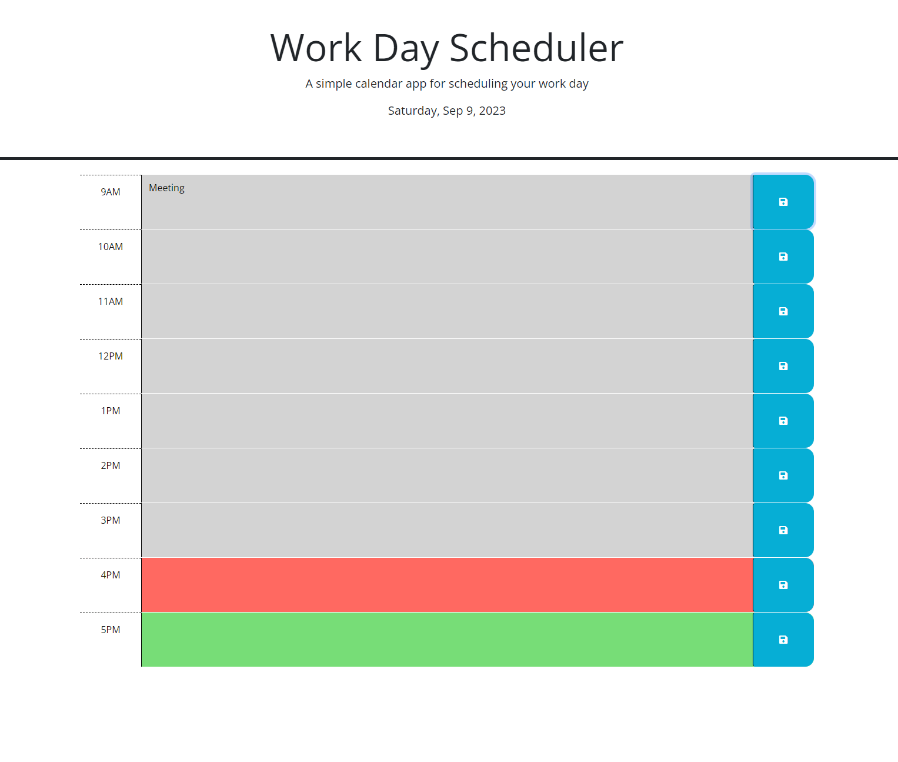

# Work Day Scheduler

## Description

The challenge was to make a Work Day Scheduler web application functional with JavaScript and JQuery. The application allows users to record their schedule in the time slots and save each entry individually. The application uses Day.js to dynamically color code the current hour, past events, and future events. My stragegy for this project was to store the user's input in local storage, and then retrieve the data when the page is refreshed. I used arrays and for-loops to organize the entries and to create the key-value pairs for local storage.  

## Usage

The website’s URL is https://beastrobel.github.io/Work-Day-Scheduler. A screenshot can be viewed below. In order to use the Work Day Scheduler, type your schedule into the time slots and click save next to each entry. The application will "remember" your schedule. The repository for this project can be found at https://github.com/beastrobel/Work-Day-Scheduler.

## Credits

The starter code for this project was provided by MSU’s Coding Bootcamp. I am responsible for coding the JavaScript portion of this project.

## License

MIT License
